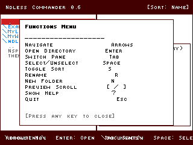

# Ndless Commander v0.6

A lightweight file explorer for TI-Nspire calculators, forked from Hoffa’s original Ndless Commander.

## Project Origin

> Huge thanks to **Hoffa** for the original source code!  
> 👉 [Omnimaga thread link](https://www.omnimaga.org/ti-nspire-projects/ndless-commander-0-4-ti-nspire-file-browser/)

This is my first Ndless project — a fun way to learn C and SDL on the Nspire.  
I’ve made some changes, fixed some stuff, broke some other stuff.

---

## Features

- Dual-pane file browser (switchable with Tab)  
- Navigate directories and see file size & date  
- Create new folders  
- Rename files / folders  
- Sort by Name / Size / Date  
- Preview scroll (kinda janky but it’s there)  

---

## Keybinds

| Key | Action |
|-----|--------|
| ↑ ↓ | Navigate list |
| Enter | Open directory |
| Tab | Switch pane |
| Space | Select/unselect item (mostly useless right now) |
| S | Toggle sort mode (Name / Size / Date) |
| R | Rename item |
| N | New folder |
| [ / ] | Scroll preview (mostly useless) |
| Menu | Open functions menu |
| Esc | Quit |

---

## Notes

- Copy / Delete are currently removed because they were being annoying. Might re-add if I can get them working nicely.
- Works on Firebird emulator (OS 4.5.4.48) and my TI-Nspire CX (OS 4.2.0.532).  
- No guarantees on other OSes or models, but it will probably work.
- Some of the text is corrupted, I'm not sure why (I didn't look all that hard though...)

---

## License

This project is based on Hoffa’s original Ndless Commander.  
The original project did not specify a license (Or if it did, I didn't see it), so this fork is shared in the same community spirit.  
If you are Hoffa and would like a license applied or attribution changed, please contact me at david.cyber86@proton.me

---

## Screenshots & Demo

**Main dual-pane view**  


**Functions menu**  


**New folder creation**  


**Rename & Stuff**


---

## 🛠️ Building

You’ll need the [Ndless SDK](https://github.com/ndless-nspire/Ndless) set up.  
Then just run where the project files are:

```bash
make

